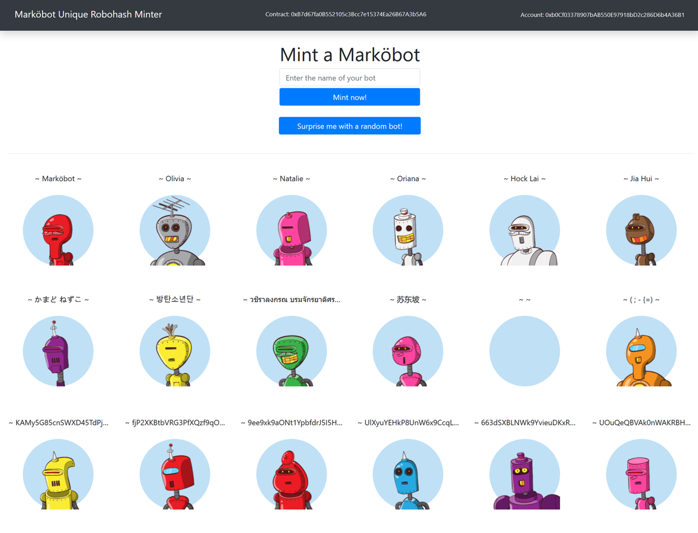

# Marköbot Infinite Robot Minter

P7210027 Mark Tan SGBT4 Blockchain Beginner Course Project

Creating an app that mints robothash bots on the fly

### `Run Ganache`
### `npm install @babel/core @babel/register --save-dev` 
### `Connect Metamask wallet`

Set up custom server at 7545 (check Ganache)

## Launch App

### `truffle test`

When all the tests have passed, 

### `npm run start`

Access the app on http://localhost:3000

## `Try it!`
